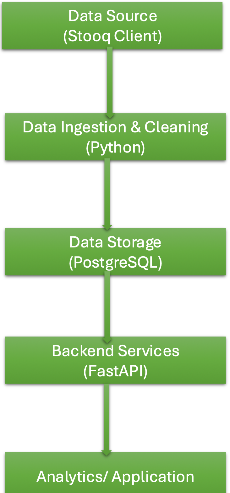

# 📊 FinSight – Financial Analytics Platform

## Overview
**FinSight** is an end-to-end financial analytics platform designed to ingest, process, and serve historical market data through reliable backend services and analytics-ready data models. The project focuses on building clean data pipelines, well-structured APIs, and a scalable foundation for financial insights and future ML-driven analysis.

The goal of FinSight is to demonstrate how real-world data systems are designed — from raw data ingestion to structured storage and API-based access.

---

## Problem Statement
Financial data is often fragmented, noisy, and difficult to analyze directly. Analysts and applications need clean, consistent, and queryable datasets exposed through reliable interfaces.

FinSight addresses this by:
- Automating data ingestion and transformation
- Structuring financial data for analytics and downstream use
- Providing API-based access to processed data

---

## Solution Architecture


This design separates concerns clearly:
- **Data layer** handles ingestion and transformation
- **Service layer** exposes data through REST APIs
- **Storage layer** ensures consistency and reliability

---

## Core Features
- Ingestion and preprocessing of historical financial data  
- Data cleaning, transformation, and validation using Python  
- Relational data modeling using SQL  
- RESTful APIs built with FastAPI for data access  
- Modular and extensible backend design  
- Cloud-ready architecture for future scaling  

---

## Tech Stack

### Languages & Frameworks
- Python
- SQL
- FastAPI

### Data & Storage
- PostgreSQL
- pandas
- NumPy

### Cloud & DevOps
- AWS (S3, EC2, IAM)
- Docker
- Jenkins
- GitHub

---

## What This Project Demonstrates
This project showcases my ability to:
- Design and implement **data pipelines** for structured analytics  
- Build **backend services** that expose data through clean APIs  
- Apply **data modeling and SQL** for consistency and performance  
- Think in terms of **end-to-end systems**, not isolated scripts  
- Write maintainable, modular, and extensible code  

---

## Current Status
FinSight is actively evolving. Planned enhancements include:
- Advanced analytics and feature engineering  
- Model integration for financial forecasting  
- Improved monitoring and logging  
- Expanded API capabilities  

---

## Getting Started (Local Setup)

```bash
# Clone the repository
git clone https://github.com/Anusha3997/finsight-ai-platform.git

# Navigate to the project directory
cd finsight-ai-platform

# Install dependencies
pip install -r requirements.txt

# Start the FastAPI server
uvicorn app.main:app --reload

## Author
- Anusha Nagula
- MS in Information Systems, University of Colorado Denver
- [GitHub](https://github.com/Anusha3997)
