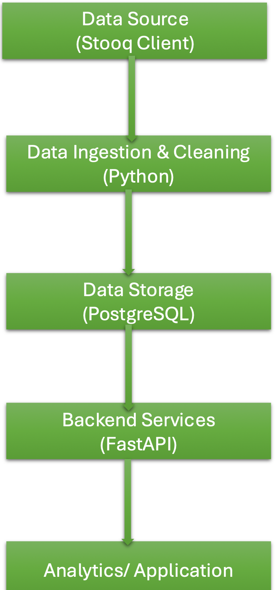

# 📊 FinSight – Financial Analytics Platform

## Overview
An end-to-end financial analytics platform from raw market data ingestion to structured storage, REST API access, and an interactive analytics dashboard.
FinSight is designed to demonstrate how production-grade data systems are built in the real world: clean ingestion pipelines, well-modeled PostgreSQL schemas, FastAPI-powered backend services, and a Streamlit dashboard all containerized with Docker Compose for repeatable, environment-independent deployment.

---

## Problem Statement
FinSight ingests historical stock market data, processes and stores it in a structured PostgreSQL database, exposes it through a typed REST API, and visualizes trends, forecasts, and risk metrics through an interactive dashboard.
It simulates the architecture of financial analytics platforms used in investment, trading, and fintech where data reliability, clean modeling, and API-first design are non-negotiable.

---

## Solution Architecture


This design separates concerns clearly:
- **Data layer** handles ingestion and transformation
- **Service layer** exposes data through REST APIs
- **Storage layer** ensures consistency and reliability

---

## Core Features
- Ingestion and preprocessing of historical financial data  
- Data cleaning, transformation, and validation using Python  
- Relational data modeling using SQL  
- RESTful APIs built with FastAPI for data access  
- Modular and extensible backend design  
- Cloud-ready architecture for future scaling  

---

## Tech Stack

### Languages & Frameworks
- Python
- SQL
- FastAPI

### Data & Storage
- PostgreSQL
- pandas
- NumPy

### Cloud & DevOps
- AWS (S3, EC2, IAM)
- Docker
- Jenkins
- GitHub

---

## What This Project Demonstrates
This project showcases my ability to:
- Design and implement **data pipelines** for structured analytics  
- Build **backend services** that expose data through clean APIs  
- Apply **data modeling and SQL** for consistency and performance  
- Think in terms of **end-to-end systems**, not isolated scripts  
- Write maintainable, modular, and extensible code  

---

## Current Status
FinSight is actively evolving. Planned enhancements include:
- Advanced analytics and feature engineering  
- Model integration for financial forecasting  
- Improved monitoring and logging  
- Expanded API capabilities  

---

## Getting Started (Local Setup)

```bash
# Clone the repository
git clone https://github.com/Anusha3997/finsight-ai-platform.git

# Navigate to the project directory
cd finsight-ai-platform

# Install dependencies
pip install -r requirements.txt

# Start the FastAPI server
uvicorn app.main:app --reload

## Author
- Anusha Nagula
- MS in Information Systems, University of Colorado Denver
- [GitHub](https://github.com/Anusha3997)
